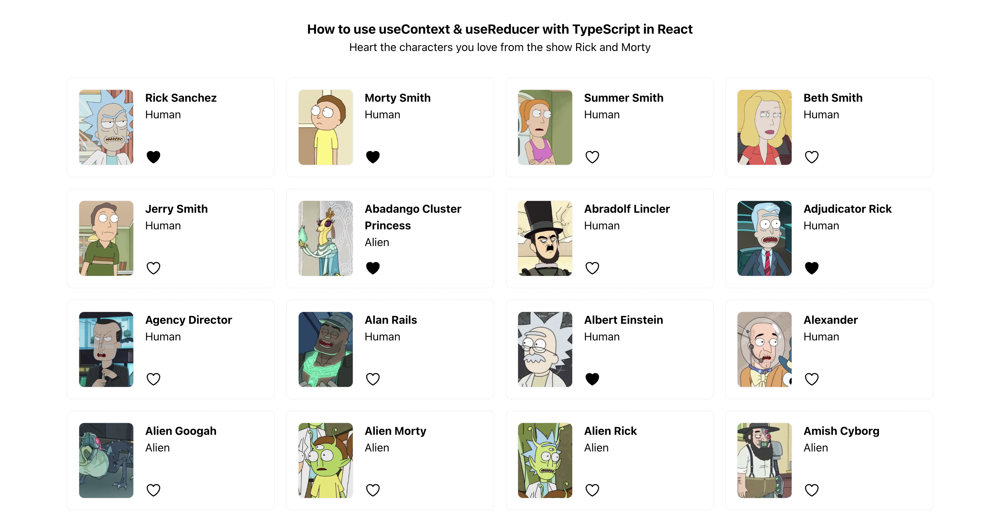

# How to Use useContext + useReducer with TypeScript in React

This React project demonstrates how to build your own state manager using `useContext` and `useReducer` and TypeScript! This app fetches character data from the Rick and Morty API, and allows you to like your favourite characters.

For a detailed guide on how to use `useContext` and `useReducer` to build your own state manager, check out the full guide. It covers:

- Setting up and creating a context
- Using a custom hook to access the context
- Employing useReducer for state management
- Creating and utilizing a reducer function
- Defining action types with enums
- Dispatching actions to update state
- Utilizing useEffect for data fetching
- Displaying data in the UI
- Liking characters

